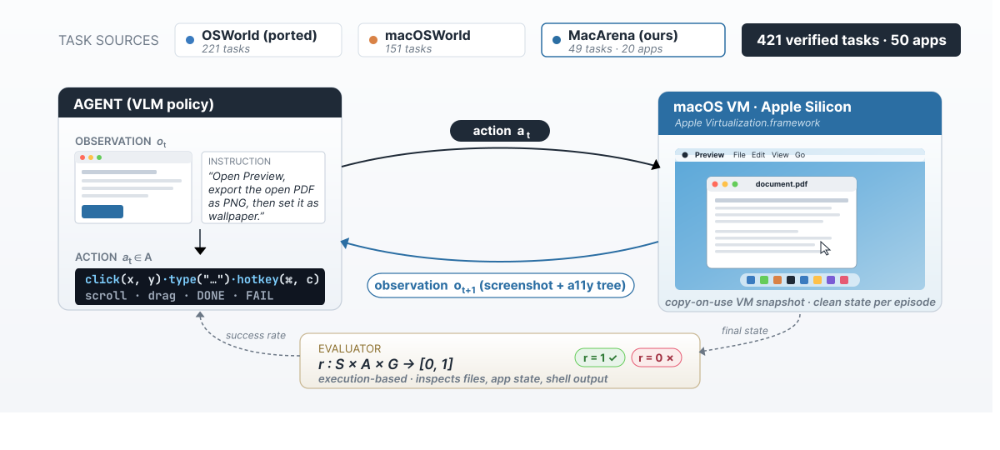

# 🖥️ MacArena: Benchmarking Computer Use Agents on an Online macOS Environment

[](https://www.python.org/)
[](https://www.apple.com/macos/)
[](https://arxiv.org/abs/xxxx.xxxxx)
[](https://huggingface.co/buckets/macpaw-research/MacArena)

A benchmark for evaluating computer and browser use agents capabilities on macOS systems. This is a specialized fork of the OSWorld repository, enhanced with tasks from macOSWorld and extended with additional custom evaluation scenarios.



---
> **🔔 Updates (June 2026)**  
> - 🎉 Our work has been accepted to the **Second Workshop on Agents in the Wild: Safety, Security, and Beyond @ ICML 2026 (Seoul, South Korea)**.
> - We release **Virtual Machines** in public access for everyone interested in testing their agents on macOS. You can download the VM image from Hugging Face and import it into UTM.  
>   👉 https://huggingface.co/buckets/macpaw-research/MacArena
---


## 📋 Table of Contents
- [Local Machine Setup](#local-machine-setup)
  - [Prerequisites](#-prerequisitess)
  - [Installation](#-installation)
  - [Quick Start](#-quick-start)
  - [Usage](#-usage)
  - [Configuration](#-configuration)
- [Citation](#-citation)

## Local Machine Setup
## 🔧 Prerequisites

Before setting up MacArena, ensure you have the following installed on your machine:

- **macOS**
- **Homebrew** package manager
- **Conda** or **Miniconda**

## 🚀 Installation

### 1. Install Required Tools

```bash
brew install --cask utm
```

### 2. Download VM Image
Download the VM image from [Hugging Face](https://huggingface.co/buckets/macpaw-research/MacArena) and import it into UTM.

### 3. Setup Python Environment

```bash
# Create and activate conda environment
conda env create --name macarena --file environment.yml
conda activate macarena
```

## ⚡ Quick Start

Run the benchmark with default settings:

```bash
python3 macos_test.py --dir ./evaluation_examples/osworld/
```

## 📖 Usage

### Basic Command

To run run benchmark on VM in manual model use the following command:
```bash
python3 macos_test.py [OPTIONS]
```

To run automatically benchmarking use this:
```bash
python3 -m runners.run_general \
    --path_to_vm "macarena" \
    --max_steps 15 \
    --max_trajectory_length 15 \
    --history_n 15 \
    --test_all_meta_path "evaluation_examples/test_macarena_second_half.json" \
    --base_url "<url_to_model>" \ 
    --model "ByteDance-Seed/UI-TARS-1.5-7B" \
    --sleep_after_execution 3.0 \
    --max_pixels 2352000 ; # 3000 * 28 * 28
```

Also, create a `.env` file in the root directory with the following content:
```env
API_KEY=<your_api_key_to_access_model_if_needed>
```

### Command Line Options

| Parameter | Type | Default | Description |
|-----------|------|---------|-------------|
| `--vm_name` | `string` | `osworld` | Name/path of the VM to use. If you use OSWorld/macosWorld tasks, use osworld, if you use macarena tasks, use MacArena |
| `--id` | `integer` | `0` | ID of the first example to run |
| `--dir` | `string` | `None` | Directory containing evaluation examples. You must to specify it |

More options can be found by running:
```bash
python3 macos_test.py --help
python3 -m runners.run_general --help
```

### Examples

```bash
# Run all examples from macosworld
python3 macos_test.py --dir ./evaluation_examples/macosworld/

# Start from a specific example ID
python3 macos_test.py --id 5 --dir ./evaluation_examples/macosworld/multi_apps/

# Use a different evaluation directory
python3 macos_test.py --dir ./evaluation_examples/macosworld/productivity/

# Combine multiple options
python3 macos_test.py --vm_name macarena --id 10 --dir ./evaluation_examples/macosworld/multi_apps/
```

## 🔧 Configuration

### Evaluation Directories

The benchmark includes several pre-configured evaluation categories:

- `./evaluation_examples/osworld/`: Tasks from original OSWorld benchmark that have been transferred to macOS
- `./evaluation_examples/macosworld/`: Tasks from macosworld benchmark
- `./evaluation_examples/macarena/`: Custom tasks created specifically for MacArena benchmark

### Distribution of Examples
```
osworld: 221
  - multi_apps: 58
  - libreoffice_calc: 45
  - libreoffice_writer: 23
  - chrome: 32
  - gimp: 24
  - vs_code: 19
  - os: 12
  - thunderbird: 8

macosworld: 151
  - sys_apps: 32
  - productivity: 30
  - file_management: 27
  - sys_and_interface: 25
  - multi_apps: 20
  - media: 10
  - advanced: 7

MacArena tasks:
  ─ advanced_apps 9
  ─ file_management 6
  ─ productivity 14
  ─ system_and_interface 8
  ─ system_apps 12
```

---

## Legal Disclaimer
This benchmark is intended for research and evaluation purposes on personal computers. By using it, you agree to the following:
1. macOS EULA: This benchmark runs macOS inside a virtual machine. Use of macOS is subject to applicable Apple’s Software License Agreement. You are responsible for ensuring you have a valid license to run macOS on your hardware.
2. UTM: The virtual machine environment uses UTM, which is licensed under the Apache License 2.0. Download and use of UTM is governed by its own license terms. This benchmark does not redistribute UTM — users must download it independently from https://github.com/utmapp/UTM.
3. Third-party applications: Some benchmark tasks involve automating third-party macOS applications. You must hold valid licenses for any such applications on your own device. This benchmark does not provide or endorse any unlicensed software.
4. Non-commercial tasks: Tasks sourced from macOSWorld are licensed under CC BY-NC 4.0 and may not be used for commercial purposes.

MacPaw Way Ltd. provides this benchmark "as is" and shall not be held liable for any misuse, licensing violations, or damages arising from the use of this tool.

## 📚 Citation
If you use MacArena in your research, please cite the following paper:

<!-- ```
@article{muryn2026macarena,
  title={MacArena: Benchmarking Computer Use Agents on an Online macOS Environment},
  author={Muryn, Victor and Shamrai, Maksym and Mazepa, Sofiia and Khodysko, Yehor},
  journal={arXiv preprint arXiv:xxxx.xxxxx},
  year={2026},
  url={https://arxiv.org/abs/xxxx.xxxxx}
}
``` -->